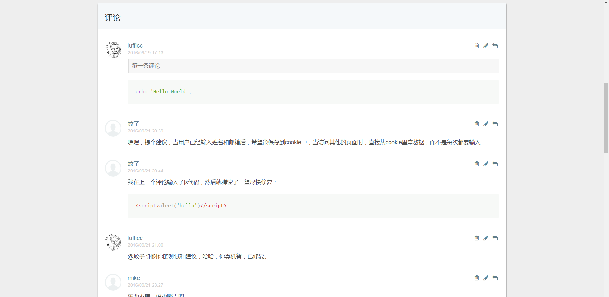
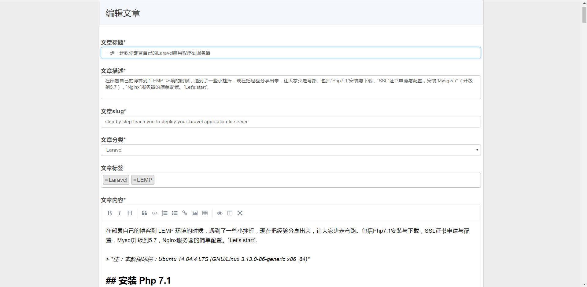
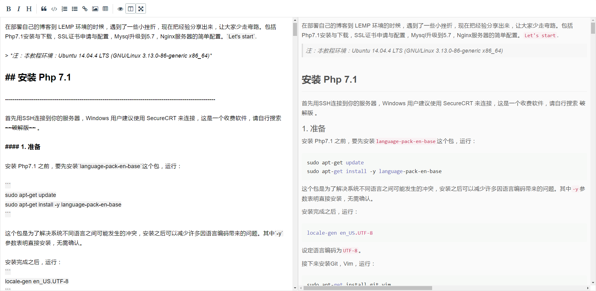
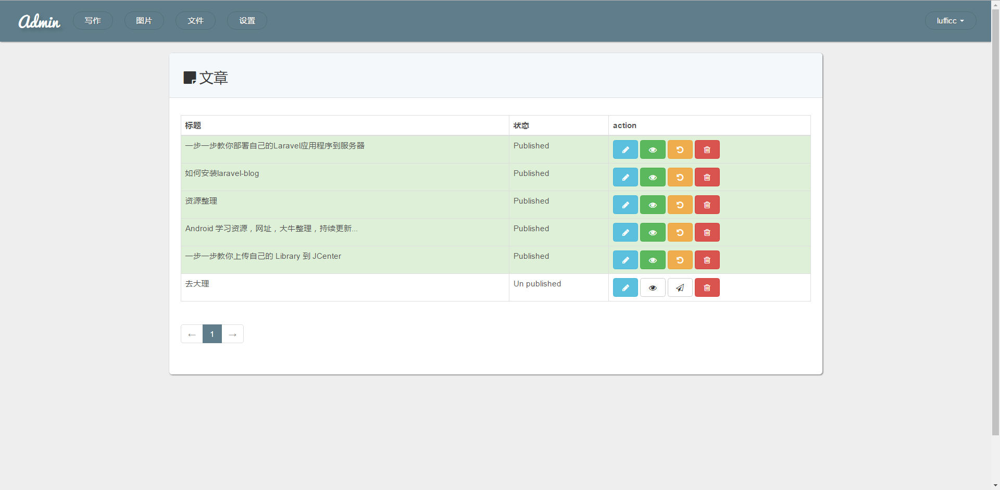
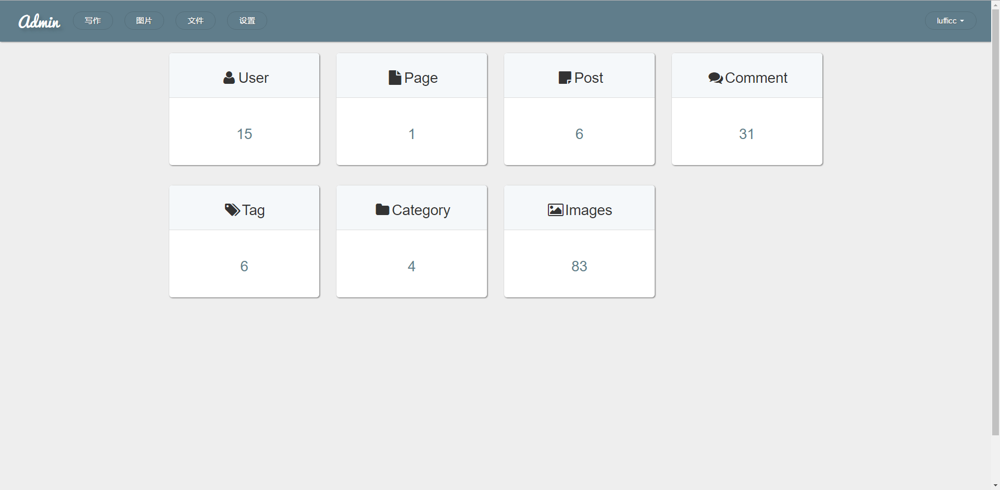
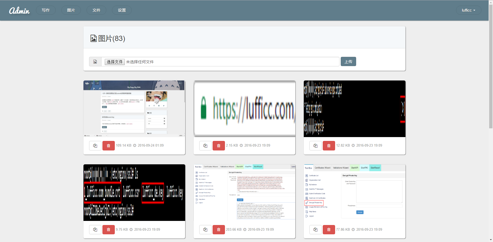
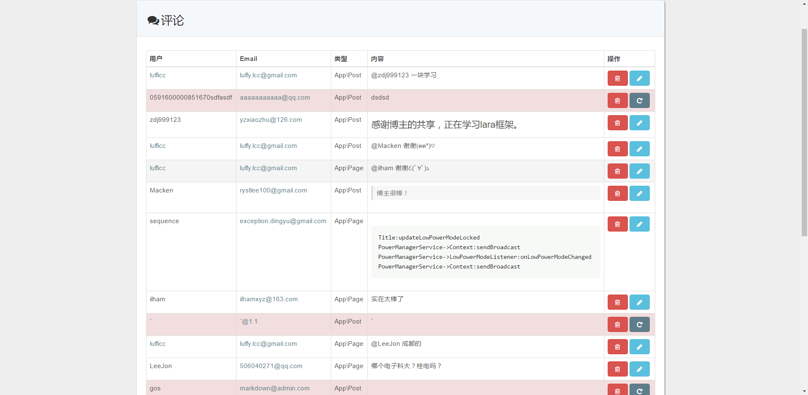
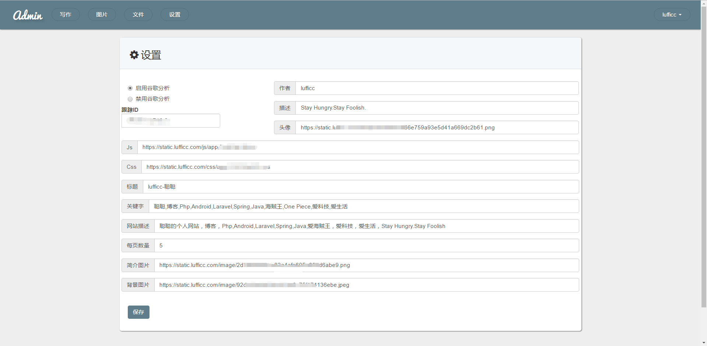

<p align="center">
  
  <br>
  <a href="https://travis-ci.org/laravel/framework"></a>
  <a href="https://packagist.org/packages/laravel/framework"></a>
</p>
<p align="center">快速，优雅, 强大的博客系统，由Laravel5.3强力驱动。点击 https://lufficc.com/blog 查看.</p>
<p align="center"><p>
<br>

# Xblog

[English readme](https://github.com/lufficc/laravel-blog)|[安装教程](https://lufficc.com/blog/how-to-install-my-blog)

这是一个我个人使用的博客，也曾经使用Hexo 和 github pages 搭过网站，都是都不灵活。因此用Laravel写了这个博客。
我想说的是Laravel是最好的php框架。

后续会分享一些写这个博客的心得，欢迎关注。

如果你发现bugs,欢迎 issue.

### 特点

1. Markdown 编辑器，支持图片拖拽，粘贴板图片上传到七牛并返回链接。
1. 完善的评论系统。
1. Github账号登录。
1. 采用 Repository 设计模式分离 Controller 和 Model 。
1. 采用Redis缓存（Cache 采用数据库 `0` ， Session 采用数据库 `1`）.
1. 图片，文件管理。
1. ~~Pjax 局部加载~~。
1. 谷歌分析，后台管理。
1. 文章可以分类，贴标签，代码高亮。 
1. XSS 保护
1. 更多自定义...
 
### 环境要求

1. "php": ">=5.6.4"
1. "mysql": ">=5.7"


## 更新日志

1. Redis 现在不是必须的了,你可以配置你自己的缓存驱动，如果你不想要缓存，将 `Repositories\Repository`中的`remember`方法 改为下面所示,这不会影响你的逻辑:
```
     public function remember($key, Closure $entity, $tag = null)
    {
        return $entity();
        //return cache()->tags($tag == null ? $this->tag() : $tag)->remember($key, $this->time, $entity);
    }

```
2. 添加搜索功能。 powered by [algolia](https://www.algolia.com/)

3. 重新命名为 Xblog ,运行 `git remote set-url origin https://github.com/lufficc/Xblog.git`更新你的url 如果你已经从laravel-blog克隆了旧的版本.

### 安装

```
git clone https://github.com/lufficc/laravel-blog.git

cd laravel-blog

// 配置你的.env文件

php artisan migrate

php artisan serve

// that's all

```


### 注意

请配置好 .env 文件,你可以复制 `.env.example` 并完成它:
```

// 七牛云，文件上传
QINIU_AK= 
QINIU_SK=
QINIU_BUCKET=


// github 登陆
GITHUB_CLIENT_ID=
GITHUB_CLIENT_SECRET=
GITHUB_REDIRECT=

// 默认用户头像
AVATAR=

```


### 截图


<p align="center">文章代码高亮<p>
<p align="center"><p>
<br>

<p align="center">评论支持Markdown<p>
<p align="center"><p>
<br>

<p align="center">写文章时实时创建多个标签，选择分类，拖拽、粘贴上传图片，自动保存.<p>
<p align="center"><p>
<br>

<p align="center">全屏写作，实时预览，不被打扰<p>
<p align="center"><p>
<br>

<p align="center">文章管理(发布,撤回,软删除,永久删除,恢复,草稿)<p>
<p align="center"><p>
<br>

<p align="center">后台管理<p>
<p align="center"><p>
<br>


<p align="center">图片管理<p>
<p align="center"><p>
<br>

<p align="center">评论管理<p>
<p align="center"><p>
<br>

<p align="center">站点设置<p>
<p align="center"><p>
<br>


### 致谢

[laravel-china](https://laravel-china.org/)

### 协议

本博客采用  [MIT license](http://opensource.org/licenses/MIT).
