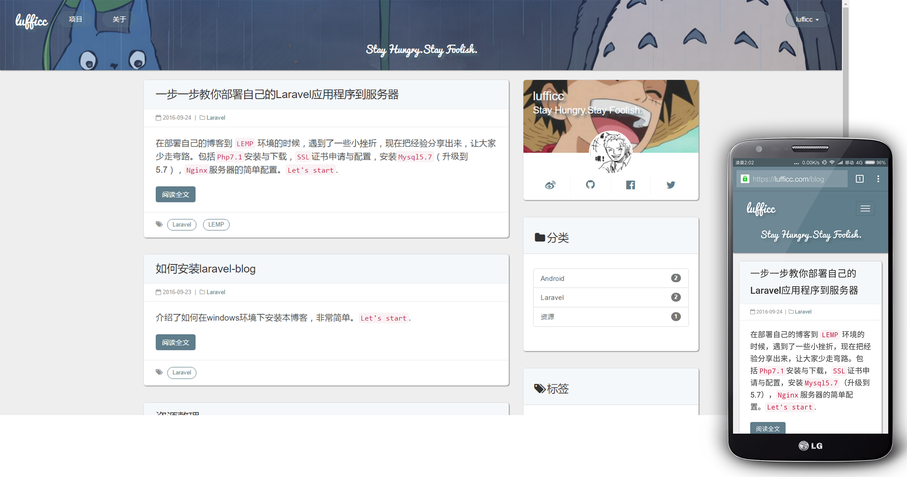

  
   
  
  
  
  

强大，响应式的博客系统，由Laravel5.3强力驱动。点击 https://lufficc.com 查看实时Demo.

 

# Xblog

[English readme](https://github.com/lufficc/laravel-blog)|[项目主页](https://lufficc.github.io/Xblog/)

这是一个我个人使用的博客，也曾经使用Hexo 和 github pages 搭过网站，都是都不灵活。因此用Laravel写了这个博客。
我想说的是Laravel是最好的php框架。

后续会分享一些写这个博客的心得，欢迎关注。

如果你发现bugs,欢迎 issue.

### 特点

1. 支持Markdown, 粘贴板、拖拽上传图片到图传(七牛云)并返回markdown链接。
1. 全屏写作模式, 实时预览, 快捷键, 自动保存, 代码高亮。
1. 文章的多状态管理(发布,撤回,软删除,永久删除,恢复,草稿)。
1. 完善的评论系统, 自带评论支持markdown。可选多说, Disqus。
1. 支持全站关闭评论, 文章(或者页面)关闭评论, 为某一篇文章(或者页面)关闭评论,强制开启评论, 自定义评论系统(多说,Disqus)。
1. 提醒功能, 有回复邮件提醒, 不错过读者回馈。
1. 分类, 多标签, 预览功能, 版权, SEO优化。
1. 图片管理, 文件管理, 后台自定义设置。
1. ............更多.............
 
### 环境要求

1. "php": ">=5.6.4"

### 致谢

[laravel-china](https://laravel-china.org/)

### 协议

本博客采用  [MIT license](http://opensource.org/licenses/MIT).
